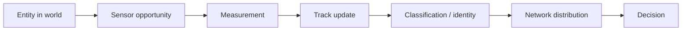
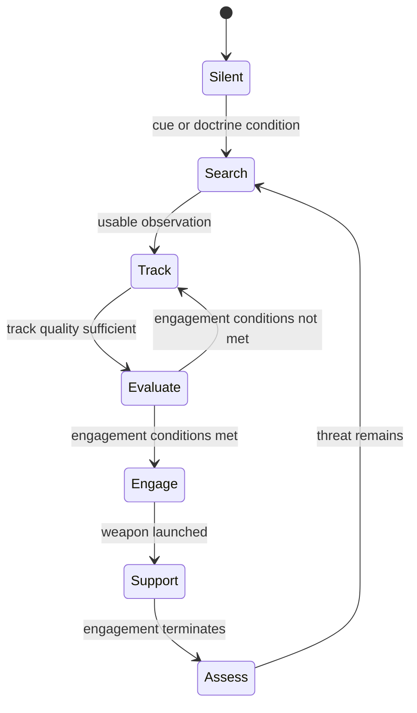
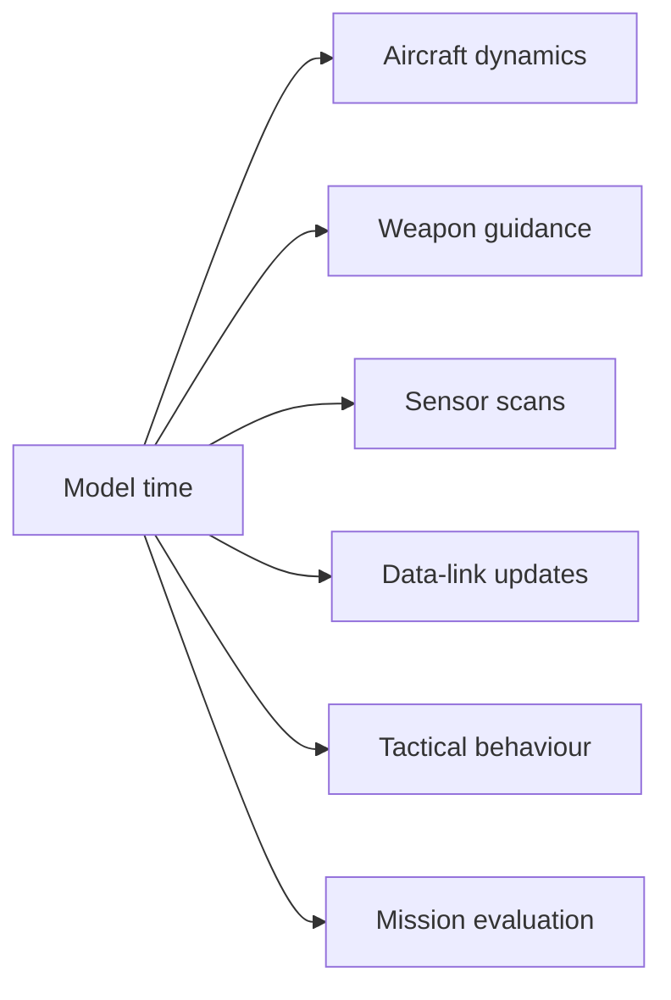
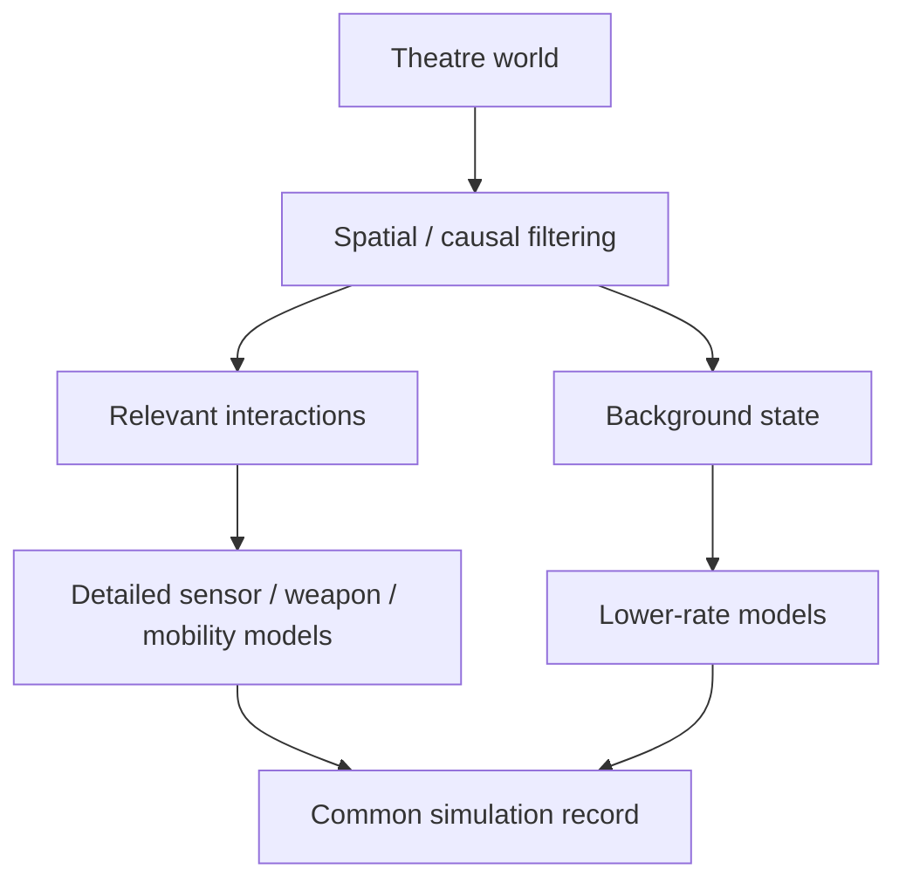
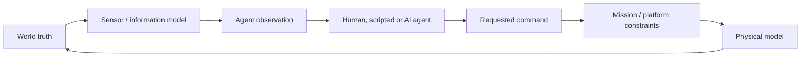

# What Engagement Simulators Need to Model in 2026

Military simulation is going through an awkward transition.

The traditional categories are still easy to recognise. Flight trainers are built around aircraft handling, cockpit procedures and avionics. Weapon-system trainers concentrate on operator workflow and system state. Wargames abstract much of that detail so a user can reason about forces, missions, logistics and command decisions at a larger scale. Simulation SDKs provide the pieces needed to build one of these environments. Autonomy programmes use synthetic worlds to test agents long before those agents are trusted on real hardware.

The boundaries between these categories are becoming less clean.

Command: Modern Operations has spent years pushing tactical models into operational and theatre-scale scenarios. VirtualSim’s vsTASKER is sold as an SDK for building synthetic environments with behaviours, sensors, networks, terrain and 2D/3D runtime views. GMSpazio’s GST² goes deep into the workflow around surface-based air defence, including target detection, tracking, identification, weapon assignment, rules of engagement, launcher state and tactical data links. NATO is explicitly investing in web-enabled, data-centric synthetic environments for planning, training, experimentation and wargaming. DARPA’s air-combat autonomy programmes have moved agents from simulation into live F-16 test aircraft.

These are not the same products, and they do not need to become the same product. What they show collectively is that the difficult part of modern simulation is moving away from a single platform model and toward a coherent synthetic world.

That matters because the battlefield being modelled has changed as well. Persistent uncrewed surveillance, cheap attritable systems, contested communications, distributed sensors and autonomous behaviour have created interactions that are difficult to represent with a collection of isolated weapon envelopes. A modern simulator has to preserve enough of the physics, information flow and decision logic for those interactions to make sense.

The most useful design question is therefore quite ordinary:

**What does the model need to get right for the decision or behaviour we want to study?**

That question is a better starting point than “how realistic can we make it?”

---

## Training simulators and wargames optimise for different kinds of truth

The word *realism* is used too loosely in simulation.

A cockpit trainer can be realistic because the switches, displays, timings and aircraft responses are representative enough for a crew to practise a procedure. A surface-based air-defence trainer can be realistic because its operators have to work through the same sequence of detection, classification, threat evaluation, weapon assignment and engagement controls that matter on the actual system. An operational wargame can be realistic while abstracting both of those things, provided its representation of force availability, mission timing, information, logistics and command decisions is good enough for the problem under study.

The distinction matters because realism is expensive. Every model detail needs data, implementation, verification and maintenance. Adding detail that does not influence the intended question raises cost without necessarily improving the result.

NASA’s modelling and simulation standard takes this problem seriously. NASA-STD-7009B requires acceptance criteria and credibility assessment to be tied to the use of the model. Its 2026 handbook expands that guidance into practical modelling and simulation practice. Defence modelling follows the same general discipline through verification, validation and accreditation processes.

For product design, the implication is simple: fidelity should be justified by intended use.

| Area | Training simulator | Engagement / wargaming simulator |
| --- | --- | --- |
| Primary concern | Representative operation of a system or crew task | Interaction of forces, missions, information and effects |
| Typical unit of attention | Operator station, vehicle, weapon system, crew | Mission package, formation, network, operational area |
| Human interaction | Performs procedures inside the system | Assigns missions, priorities, constraints and decisions |
| Model emphasis | Controls, avionics, timings, system states, procedural response | Sensor relationships, force behaviour, timing, resources, mission outcomes |
| Time | Usually real-time or near real-time | Frequently accelerated, paused, stepped and repeated |
| Main validation question | Does the training behaviour represent the task? | Does the abstraction preserve the interactions relevant to the study? |

GMSpazio’s GST² is a useful example of how narrow scope can support depth. Its public description focuses on surface-based air-defence training. Missile performance is present, but the training workflow spends at least as much attention on radar state, target tracking, classification, launcher status, rules of engagement, weapon-control states and command modes. It also includes Link 16-oriented tactical data-link context and Distributed Interactive Simulation interoperability.

Command: Modern Operations solves a different problem. Its documentation describes a tactical-operational simulation that can scale into theatres where logistics, turnaround cycles, intelligence, force allocation and mission tasking dominate. Individual systems still matter, but the user needs abstractions that allow hundreds of units to act without direct manual control.

The two products are useful precisely because they put realism in different places.

That is the first principle worth carrying forward into new simulator design.

---

## The industry is converging on a world model, even when the interfaces look different

There is a noticeable pattern across current simulation products.

Command organises large scenarios around missions, doctrine and rules of engagement. vsTASKER exposes state machines, behaviour trees, knowledge, navigation, sensors, weapons, communications and synthetic environments as building blocks. GST² represents the operational chain around an air-defence weapon system. NATO’s Next Generation Modelling and Simulation programme has described a persistent, web-enabled, modular synthetic environment that can support planners, decision-makers and warfighters across domains.

These products grew from different requirements, but they all need a way to represent three things consistently:

1. the state of the world;
2. what each participant can observe about that world;
3. how participants behave as the state changes.

That sounds obvious until several domains interact.

Take an air mission involving fighters, a surveillance radar, an airborne early-warning aircraft, a surface-to-air missile battery and a defended installation. The aircraft trajectories matter, because position, altitude and energy determine where the force can go. Radar behaviour matters because the defending side does not automatically know those trajectories. Communications matter because an observation made by one platform may become useful to another platform only after it is shared. Mission logic matters because the fighters and SAM battery are not simply moving toward the nearest opponent. Weapon behaviour matters once an engagement begins. Timing connects every one of these systems.

A simulator becomes fragile when each of those interactions is implemented as a special case.

A better representation starts with one evolving world.

```editorial-diagram
causal-simulation-loop
```

The usefulness of this model is not the diagram itself. It is the separation of responsibilities.

The world holds the physical state. Sensors produce observations of it. Track processing turns observations into estimates that belong to a side or participant. Networks move some of those estimates. Behaviour works with the information available to the participant, together with mission and doctrine. Actions then change the world through movement, emissions, weapons or other effects.

Once those boundaries are explicit, a surprising amount of complexity becomes easier to reason about.

---

## Physics still matters, but the whole battlefield does not need the same physical model

There is no credible engagement simulation without physical constraints.

Aircraft cannot turn instantaneously without losing or gaining energy. Weapons cannot continue manoeuvring after they run out of useful energy. Terrain can block line of sight. Ships and ground vehicles have different mobility constraints. Fuel, altitude, speed and range all shape mission timing.

The mistake is assuming that every object must therefore be represented at the same physical fidelity.

The intended use usually tells us how much motion detail is needed.

A transport aircraft crossing the edge of a theatre may only require a route, speed and altitude profile. A fighter participating in a beyond-visual-range engagement benefits from a three-dimensional point-mass model that preserves useful energy behaviour. A close manoeuvring study may need full six-degree-of-freedom dynamics and validated aerodynamic data.

A well-structured simulator can carry all three representations in one scenario because they answer different questions about the same world.

Command already works with this kind of abstraction at the product level. Its documentation is explicit that tactical detail matters, while the operational scale brings other factors such as logistics, intelligence and mission tasking to the foreground. vsTASKER approaches the same issue from an SDK perspective: models and behaviours can be attached to entities at different levels of sophistication, while the scenario continues to run in one environment.

For future simulators, the practical direction is mixed fidelity. High-detail models should be reserved for entities whose behaviour can change the analysis. Background traffic, static systems and distant support assets can use cheaper models until the scenario makes them relevant.

This is as much a modelling discipline as a performance optimisation.

---

## The information model is where many simple simulators lose credibility

A tactical display often makes the world look cleaner than it is.

The simulator knows the exact position, velocity, identity and state of every entity because it has to advance them. That omniscient state is convenient for rendering and debugging. It is dangerous if it leaks into the behaviour of simulated participants.

A defending fighter should not know the true position of an opposing aircraft because the simulation engine knows it. It should know whatever its own sensors, other sensors and communication paths have allowed it to know.

The difference is foundational.

The same physical aircraft can exist as several different tracks in the same scenario. A ground radar may hold a coarse estimate. An airborne early-warning platform may have a better estimate. A fighter receiving that track over a data link may have a delayed version. A unit that lost connectivity may be predicting an ageing track. Another unit may have no usable contact at all.

Once the simulation preserves those distinctions, systems such as AWACS, data links, electronic support and jamming begin to have real consequences.

This is also where operator-oriented products such as GST² are instructive. Detection, tracking, identification, threat evaluation and weapon assignment are presented as separate training activities because operationally they are separate states. Command likewise models contacts, sensor state, doctrine and emissions as part of the interaction rather than giving every unit a universal tactical picture.

A modern simulator should therefore treat sensing as a pipeline.



The models inside that pipeline can start simple. A first radar model may use geometry, line of sight, field of regard and scan timing before introducing propagation, clutter or detailed target signatures. The architecture matters more than the first equation.

A range circle is useful for orientation. It should not automatically become knowledge.

---

## Missions and doctrine are how theatre-scale behaviour remains manageable

Theatre-scale simulation is often discussed as a compute problem, but user control becomes a bottleneck long before the processor does.

A scenario containing hundreds of aircraft, radars, ships and ground systems cannot rely on a human user assigning every turn, sensor state and weapon action manually. The simulator needs a representation of intent that survives as the world changes.

Command’s mission system is one of the clearest mature examples. Its documentation calls missions a fundamental simulation construct. Mission types can carry doctrine, rules of engagement and emission-control settings. Strike elements and escorts can have different behaviour. Patrols operate within defined areas. Support missions maintain supporting positions and schedules. The user can still intervene, but the mission abstraction handles routine tactical behaviour.

This is the level at which a future scenario builder should become interesting.

A mission defines an objective and assigns forces. Doctrine constrains how those forces may behave. A task describes the current responsibility of a unit. Behaviour interprets the available information and produces the next action.

An air-defence battery tasked with protecting an installation could remain electronically silent while off-board surveillance is sufficient. A credible approaching track may cause it to search locally. Engagement may still be held because of identification, geometry, rules of engagement, weapon availability or a higher-level control state. If the engagement proceeds, a separate support state may exist until the interceptor becomes independent or the engagement ends.

This sequence is well represented as state because state makes the assumptions reviewable.



A domain expert can inspect those transitions and challenge them. An engineer can test them. A user can understand why the unit waited.

This is a better path to believable autonomy than hiding tactical behaviour behind a generic “AI” label.

---

## Time is part of the model, not just the playback speed

Most simulator interfaces make time visible through controls such as pause, 2x or 10x. Underneath, model time is one of the main reasons engagements diverge.

Sensors do not necessarily observe continuously. Communications introduce delay. Tracks age. Weapons move on their own guidance cadence. Mission decisions can be evaluated less frequently than flight dynamics. Fuel consumption and readiness accumulate. Reinforcements arrive at scheduled times. A target that is detectable now may not have been detectable at the previous sensor update.

The result is that two systems can occupy the same geometry without reacting at the same instant.

A radar may receive its next scan opportunity a second after a target enters its field of regard. The track processor may need additional observations. A network may introduce further delay before a shooter receives the information. A few seconds can determine whether the shooter engages before the target crosses a release point or leaves the engagement area.

Command has had to address this explicitly as scenario scale increased. Its current documentation describes normal and high-fidelity simulation time slices, including a 0.1-second high-fidelity mode, and the product has continued adding accelerated time modes while preserving finer updates where required.

The systems lesson is broader than Command’s implementation. Different parts of the same world need different temporal fidelity.



The model clock establishes ordering. Individual systems decide when they are due to update.

This becomes essential at theatre scale because the simulation can spend computation according to the rate at which a behaviour actually changes.

---

## Theatre scale depends on relevance, abstraction and good scheduling

A scenario with one hundred entities contains thousands of possible relationships. At one thousand entities, evaluating every possible interaction indiscriminately becomes wasteful.

Fortunately, most relationships are irrelevant most of the time.

A radar only needs detailed consideration of objects that could plausibly interact with it. An interceptor missile only needs a narrow set of states. A tanker far from the engagement can remain on a low-rate route and fuel model. A fixed sensor needs no mobility calculation. A terminated entity needs to remain in the historical record without consuming the same runtime attention as an active one.

A theatre simulator therefore benefits from two kinds of selectivity.

The first is spatial and causal relevance. Cheap broad-phase logic identifies which interactions deserve expensive modelling.

The second is model fidelity. Entities involved in a decisive engagement can receive more detailed updates than distant background actors.



This is why theatre simulation cannot be reduced to “run the same entity loop on a larger server”.

The world model, mission abstraction and scheduler all contribute to scale.

NATO’s interest in a persistent, modular, web-enabled synthetic environment reflects the same systems problem at a much larger institutional level. Its Next Generation Modelling and Simulation study explicitly discusses common data, architecture, tools and standards across domains and application areas. The 2026 Alliance Digital Strategy goes further, calling for synthetic environments and modelling and simulation services to support research, collective training, wargaming and multi-domain mission rehearsal.

The strategic demand is moving toward shared synthetic environments. The architecture has to keep up.

---

## Drone warfare exposes the weaknesses of platform-centric simulation

The spread of uncrewed systems changes simulation requirements in ways that are easy to underestimate.

Many legacy engagement models were built around relatively scarce platforms with significant individual capability. Modern drone warfare adds large numbers of cheaper systems that may provide observation, communication relay, deception, strike or simple presence. Their operational value often comes from persistence, distribution and replacement cost rather than from the sophistication of one vehicle.

This creates different modelling questions.

The number of active entities rises. Communications become less reliable as electronic warfare becomes routine. Defenders face an economic problem when an expensive interceptor is used against a cheap target. Persistent observation changes how long a manoeuvring unit can remain concealed. Decoys and expendable systems can force defenders to reveal sensors or consume inventory. A small autonomous vehicle may continue operating after losing a communication link, depending on its onboard behaviour.

The underlying flight dynamics of many of these objects are not particularly difficult compared with a high-performance fighter.

Their battlefield effect comes from the network and the numbers.

A useful simulator therefore needs to represent inventory depth, attrition, sensing, communications, replacement, endurance and cost alongside geometry. It should also be able to run large populations without insisting that every vehicle uses the most expensive model.

The asymmetric dimension is important. The question may be whether a defence network can sustain repeated low-cost attacks over time, rather than whether one interceptor defeats one target.

That is a different kind of engagement study.

---

## AI agents are useful when the simulation constrains them

The defence industry is no longer discussing autonomous agents only as a future possibility.

DARPA’s Air Combat Evolution programme moved AI agents from synthetic dogfights onto the X-62A VISTA test aircraft. DARPA reports that the programme conducted autonomous F-16 versus human-piloted F-16 within-visual-range test flights, and in 2026 the agency and U.S. Air Force announced autonomous flights using VENOM-modified F-16s. DARPA’s Artificial Intelligence Reinforcements programme is now explicitly working on harder dimensions such as integrated sensors, larger engagements, uncertain knowledge and changing conditions.

Those programmes are relevant to simulation architecture because they show what happens when the agent and the world are kept separate.

An agent should receive an observation consistent with what its simulated platform could know. It returns a requested action. Mission rules and platform constraints determine whether the action is valid. The physical model determines what happens next.



That boundary allows several control models to coexist.

One unit can be human-controlled. Another can use deterministic doctrine. Another can use a behaviour tree. Another can run a learned policy. They still participate in the same scenario because none of them owns world truth directly.

The interesting future use of agents is broader than autonomous dogfighting. Agents can populate opposing forces in repeated experiments, operate supporting units, generate adaptive responses to a plan or help explore scenario variations that would be impractical to staff with humans.

Simulation also provides the discipline these agents need. A successful policy in a synthetic environment is only as meaningful as the assumptions behind the environment. DARPA’s progression from simulation to test aircraft is a reminder that synthetic success and real-world validity are different claims.

For simulator builders, that makes observability important. When an agent takes an unexpected action, the record should preserve what information it received, what it requested and what consequence followed.

---

## Browser-based simulation changes who can access the model

The browser is becoming a plausible execution environment for classes of simulation that previously defaulted to desktop software.

WebAssembly provides a portable binary execution format intended for efficient execution across web and non-web environments. Modern browser APIs also allow computational work to run away from the main interface. Mapping and 3D libraries have matured enough to support large spatial scenes and time-varying geometry.

None of this eliminates the computational cost of simulation.

Detailed flight dynamics still consume work. A large Monte Carlo study still needs many runs. Large synthetic environments still require careful data handling.

The change is distribution.

An interactive run can execute on the user’s machine while the browser handles authoring, playback and analysis. The simulation does not need a network request for every model step. Scenario packages and simulation records can be shared through ordinary web distribution. Users can inspect a scenario without first installing a large specialised client. Large batch studies can still use dedicated compute without forcing every normal interaction through that infrastructure.

NATO’s own Next Generation Modelling and Simulation study uses the phrase “web-enabled” when describing the synthetic environment it is exploring. That is notable because the motivation is not a consumer-web experience. The attraction is accessibility, modularity and reuse across applications.

For smaller research teams and open-source projects, this distribution model matters even more. It makes reproducible simulation easier to share.

The browser does not make simulation free. It makes simulation easier to distribute.

---

## Simulation interfaces need to become more legible

Defence software often inherits the visual language of the systems it replaces. Dense tables, modal dialogs and large control panels make sense when the software is reproducing an operator workstation. They make less sense when the goal is analysis.

A modern engagement simulator has several distinct analytical surfaces.

The 2D map is still difficult to beat for force disposition, routes, sectors, sensor coverage and operational scale. Three-dimensional views become useful when altitude, terrain or trajectory geometry is central to the question. An event timeline is better for understanding why a sequence unfolded. A side-specific information view can show the difference between world truth and the tactical picture available to a participant.

The strongest design uses all of them against the same simulation record.

```editorial-diagram
one-record-many-views
```

vsTASKER already demonstrates one version of this workflow, with a 2D map used for scenario editing and runtime control alongside 3D visualisation. Command has continued improving its operational map and altitude visualisation because the map remains the main reasoning surface even in a deeply modelled simulation.

There is room to take this further.

A simulator can reveal complexity progressively. A new user can start from a complete mission template. A more experienced user can change doctrine, sensor state or weapon configuration. A domain expert can inspect the transition that caused an engagement. An engineer can trace that same event through the deterministic simulation record.

The aesthetics of the interface matter because legibility affects judgement.

A scenario with several sensor sources should make provenance visible. An assumed range should look different from a value derived by a model. Scripted scenario events should be distinguishable from simulation-generated events. Side-specific tracks should not be confused with world truth.

Visual design is part of the model’s explanatory surface.

---

## The event record deserves equal status with the map

Most engagement simulators are remembered through their map or 3D view.

For analysis, the event record can be just as important.

The simulator already knows when a radar changed state, when an observation was generated, when a track was confirmed, when a message arrived, when a mission transitioned, when a weapon launched and when an effect changed a capability. Recording those transitions creates a causal history of the run.

A useful event stream might look like this:

```text
06:18:02  Surveillance radar enters search state
06:18:08  Observation generated on BLUE STRIKE 1
06:18:13  Track R-031 confirmed
06:18:14  Track R-031 received by SAM BATTERY 1
06:18:16  Engagement evaluation begins
06:18:16  Weapon release held: geometry outside configured condition
06:18:42  Engagement conditions satisfied
06:18:43  Interceptor launched
06:18:48  BLUE STRIKE 1 begins defensive task
06:19:03  Strike weapon released
06:19:22  Interceptor support lost
06:19:46  Strike weapon reaches objective
06:20:02  Objective capability degraded
06:20:05  Blue mission enters egress
```

This record serves several audiences at once.

The user can reconstruct the battle. The domain expert can challenge a state transition. The developer can debug unexpected behaviour. The analyst can compare two runs and determine where they first diverged.

Tacview has already demonstrated the value of separating simulation from telemetry replay and debrief. A next-generation analytical simulator can preserve more than position and orientation. It can retain the observation, track, task and effect history that explains the motion.

This has an important consequence for explainability. The system does not need to invent a narrative after the run if the causal events are already recorded.

When a user asks why a SAM did not engage, the answer can be reconstructed from actual state:

```text
Target entered geometric coverage
→ off-board track was below required quality
→ local radar remained silent under configured doctrine
→ track matured after the target passed the preferred engagement window
```

That explanation is useful because it can be argued with.

---

## The next generation will combine ideas that currently live in separate products

There is no shortage of capable military simulation software. The interesting gap is in how these ideas are assembled.

Command demonstrates what a mission-oriented tactical-operational simulation can do when it has a large system database, mature doctrine and years of work on autonomous unit behaviour.

vsTASKER shows the flexibility of treating simulation as an SDK, where entities, behaviours, networks and visual environments are assembled for a specific application.

GST² shows the importance of modelling operator logic and command context around the weapon, rather than stopping at the interceptor trajectory.

Distributed military training environments show why interoperability matters once multiple human and constructive participants need to occupy the same synthetic battle.

DARPA’s autonomy programmes show simulation becoming part of the development pipeline for agents that eventually move onto real aircraft.

Current drone warfare adds pressure from the other direction. A simulator now needs to handle large numbers of cheap systems, persistent sensors, contested links and rapidly changing tactics without giving every entity exquisite modelling.

Taken together, these developments point toward a simulator that is less monolithic.

The world model should be stable. The mobility, sensing, communications, behaviour and effect models should be replaceable at appropriate fidelity. Missions should provide intent above individual actions. Human and autonomous participants should receive bounded observations rather than privileged access to the world. 2D, 3D and debrief should consume the same record.

The resulting system is easier to extend because a new platform does not require a new simulation architecture.

That is the direction worth pursuing.

---

## Where Vector Engagement Labs fits

[Vector Engagement Labs](https://github.com/SrivatsaRv/vector-engagements-labs) is our attempt to explore this architecture in the open.

The project is pre-alpha research software. We are starting with the air domain because it is bounded enough to build carefully while still forcing us to solve several important interactions: aircraft movement, guided weapons, surface-based air defence, airborne early warning, radar, tactical information, mission behaviour and time.

The immediate product shape is a scenario workbench.

Users should be able to begin with a prepared mission or construct one from a blank scenario. The same underlying model should support both. Forces, routes, loadouts, sensors, mission intent, environmental assumptions and behaviour can be changed before the run. The simulation then advances one world and produces one record that feeds the map, 3D view, event timeline and analysis.

The standard we are trying to hold is causal rather than visual.

Removing an airborne early-warning asset should change the information available to the rest of the force. Interrupting a data link should affect track freshness and support paths. A silent radar should stop contributing observations. An aircraft entering a nominal SAM range should not trigger an engagement unless the rest of the model supports that decision. Changes in mission behaviour should come from the state available to the participant rather than from a scripted animation.

The long-term direction is multi-domain. We are deliberately treating that as an architectural requirement rather than a reason to build shallow air, land and maritime features at the same time. If the world, mission, information and event models are sound, additional domains can enter through new models and capabilities without creating separate simulation loops.

The repository and workbench are public because these assumptions are easier to improve when they can be inspected.

---

## Conclusion

Simulation in 2026 is being pulled in two directions.

One direction is toward greater physical and procedural fidelity. Better aircraft models, sensor representations, human-machine interfaces and hardware integration continue to improve specialist trainers and engineering environments.

The other direction is toward larger synthetic worlds. Multi-domain planning, autonomous agents, distributed sensors, large uncrewed populations and operational wargaming require abstractions that can survive scale.

The next generation of engagement simulators will have to live between those demands.

The difficult part is maintaining coherence.

Physics establishes what the entities can do. Sensors determine what can be observed. Networks determine what information moves. Missions and doctrine shape behaviour. Time determines when those relationships become relevant. Effects alter the capabilities that remain. The event record preserves enough of that sequence for a user to understand the result.

A simulator becomes useful when those pieces agree with each other.

That may be a better measure of realism than visual detail alone.

---

## References

1. [Command: Modern Operations, Introduction](https://command.matrixgames.com/manual/introduction/)  
   Official overview of Command’s tactical-operational scope and theatre-level modelling.

2. [Command: Modern Operations, Missions](https://command.matrixgames.com/manual/missions/)  
   Official documentation describing missions as a core simulation construct, including doctrine, rules of engagement and emission control.

3. [Command: Modern Operations, Manual Addendum: User Interface](https://command.matrixgames.com/?page_id=2697)  
   Official documentation on simulation time slices and high-fidelity execution.

4. [Command: Modern Operations, Mega-FAQ](https://command.matrixgames.com/?page_id=2920)  
   Official discussion of sensors, physics, doctrine and tactical-operational behaviour.

5. [VirtualSim vsTASKER](https://www.virtualsim.com/products/vstasker/)  
   Product overview covering scenario building, 2D/3D environments, state machines, behaviour trees and distributed simulation interfaces.

6. [vsTASKER Technical Specifications](https://www.virtualsim.com/products/vstasker/features/)  
   Detailed product feature reference.

7. [GMSpazio GST² Surface Based Air Defence Tactical & Training Simulator](https://www.gmspazio.com/gst%C2%B2-gmspazio-surface-based-air-defence-tactical-training-simulator/)  
   Product description covering detection, tracking, doctrine, weapon assignment, data links and air-defence training.

8. [NATO Next Generation Modelling and Simulation](https://www.act.nato.int/article/nexgen-modelling-and-simulation/)  
   NATO Allied Command Transformation material describing a persistent, web-enabled and modular synthetic environment.

9. [NATO Alliance Digital Strategy, 2026](https://www.nato.int/en/about-us/official-texts-and-resources/official-texts/2026/01/13/alliance-digital-strategy)  
   NATO policy direction for synthetic environments, modelling and simulation, wargaming and multi-domain mission rehearsal.

10. [NASA-STD-7009B: Standard for Models and Simulations](https://standards.nasa.gov/standard/nasa/nasa-std-7009)  
    Public standard on modelling and simulation acceptance criteria and credibility.

11. [NASA Handbook for Models and Simulations, 2026](https://standards.nasa.gov/standard/nasa/nasa-hdbk-7009)  
    Current implementation guidance for NASA-STD-7009B.

12. [DARPA Air Combat Evolution](https://www.darpa.mil/research/programs/air-combat-evolution)  
    Programme information on air-combat autonomy and human-machine collaboration.

13. [DARPA ACE transition from simulation to live flight](https://www.darpa.mil/news/2023/ace-program-transition)  
    Description of ACE agents moving from simulation onto the X-62A VISTA.

14. [DARPA and U.S. Air Force AI-controlled F-16 flights, 2026](https://www.darpa.mil/news/2026/darpa-us-air-force-fly-ai-controlled-f-16)  
    Current update on VENOM autonomous flight testing.

15. [DARPA Artificial Intelligence Reinforcements](https://www.darpa.mil/research/programs/artificial-intelligence-reinforcements)  
    Programme covering integrated sensors, larger engagements, uncertainty and adaptive tactical autonomy.

16. [WebAssembly](https://webassembly.org/)  
    Official overview of the portable WebAssembly execution model.

17. [WebAssembly Portability](https://webassembly.org/docs/portability/)  
    Official discussion of efficient cross-platform execution.

18. [Vector Engagement Labs](https://github.com/SrivatsaRv/vector-engagements-labs)  
    Open-source pre-alpha engagement simulation workbench.
